## Список поддоменов
- Worker recruitment and management
- Matching worker cats to unique client needs
- Order Fulfillment
- Client Loyalty and Retention (Cookies and sales)
- Quality Control of Orders
- Manager Motivation and Performance
- Storage and Preparation of Consumables

## Core Domain Chart

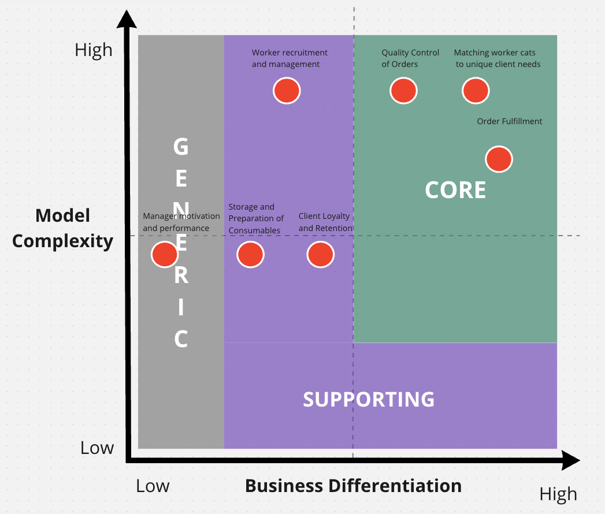

## Bounded contexts

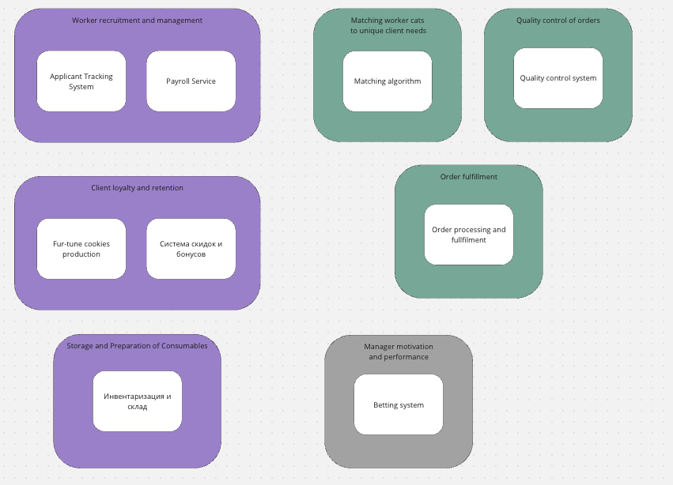

## Различия в ES и Bounded Contexts
### Worker recruitment and management вместо Hiring и Billing
Я разбил **Billing** между **Hiring** и **Order fulfillment** контекстами, потому что в первом случае мы платим воркерам, а в другом забираем денюжку у клиентов. Это разные процессы и относятся они к разным доменам. Так же в уроке есть пример с "**назвать боундед-контекстом технический кусок проекта, который этим контекстом не является.** " где приводится пример с биллингом. Вопрос: нужно ли явно указывать биллинг клиента? Я не указывал, посчитал что это подразумевается само собой что он платит за заказы.

### Matching и Order Fullfilment вместо Clients/Workers platform
Разбил Clients/Workers platform на Matching и Order fullfilment, так как алгоритм будет разрабатывать другая команда, у них свой общий язык и вообще много подсказок было в чатике что это отдельный контекст.

## Обновления ES

- [Full PDF of new ES schema](./es_on_bounded_contexts.pdf)
- [Miro link with everything](https://miro.com/app/board/uXjVMJwgTXY=/?share_link_id=980702483848)

### Я довольно сильно изменил Hiring домен

#### Before
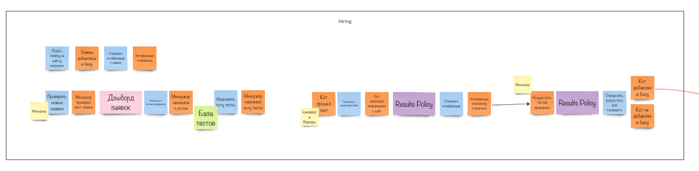

#### After

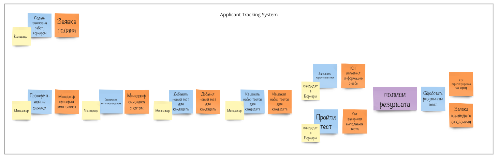

### Так же в системе выполнения заказов

#### Before
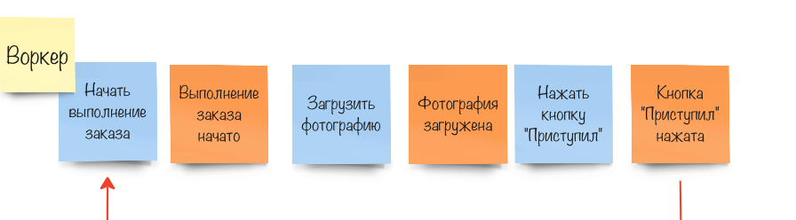
#### After
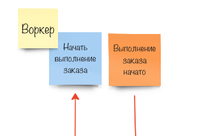

---

#### Before
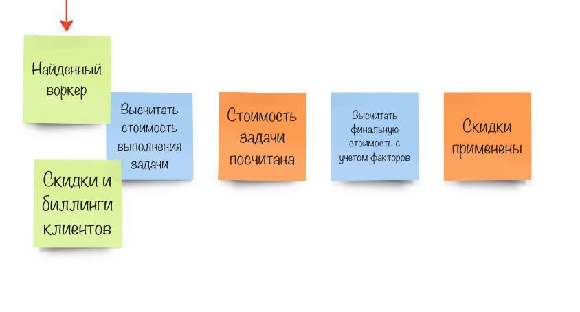
#### After
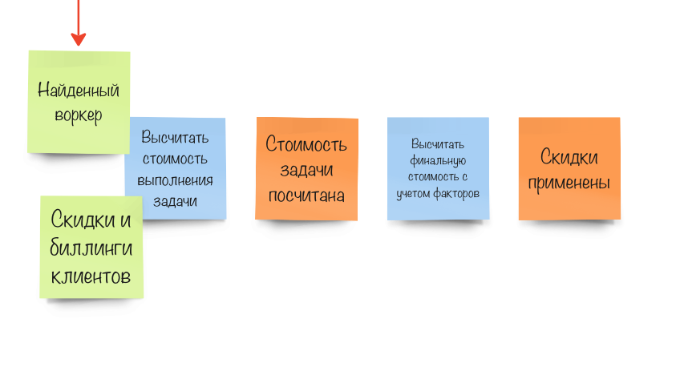

---

### Биллинг/Система скидок и бонусов

#### Before
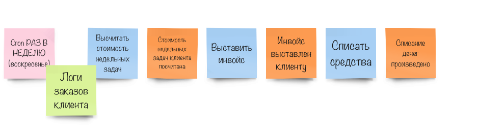
#### After
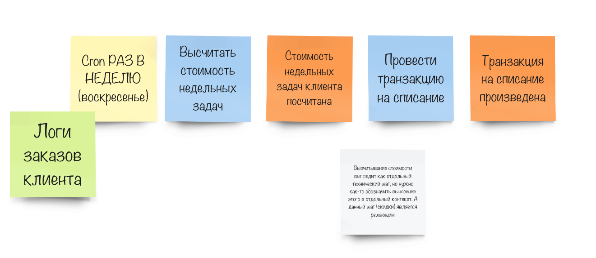

---

#### Before
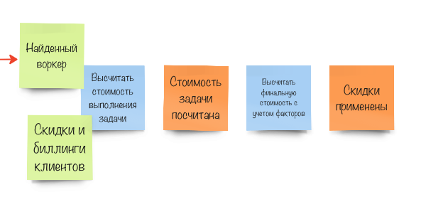
#### After
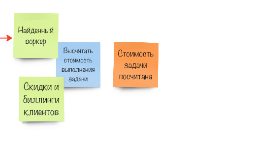

## Data model
Я постарался убрать некоторые стрелочки, которые были очевидны (ордер консьюмится много где, так же клиент и т.д.) но оставил продьюсеров, раскрасив их синим цветом.

* Синий - продьюсеря
* Серый - консьюмеры
* Синие пунктирные стрелочки - асинхронные сообщения
* Черные стрелочки - синхронные сообщения

[Full svg](./data_model.svg) | [Link to d2 source](./data_model.d2)

## Список характеристик
1.  **Availability**: система должна быть доступна для пользователей, особенно учитывая возможные атаки конкурентов ([US-081]).
2.  **Scalability**: С увеличением числа котов-воркеров и клиентов, система должна масштабироваться для поддержания высокого уровня производительности и обработки запросов ([US-080]).
3. **Modifiability и Maintainability:** 
	- Поскольку алгоритм матчинга может меняться или дополняться, важно обеспечить возможность простого добавления или редактирования шагов в системе без значительных затрат на разработку и обновление ([US-070]).
	- Для бизнеса критично проверять новые гипотезы по отсеву котов и изменять уже существующие с максимальной скоростью и надёжностью.
4. **Securability:** [US-050] (Формула секретная, значит нужно продолжать держать её в секрете)
5. **Usability:** для успешного использования системы клиентами и менеджерами, удобство интерфейса и доступность функциональности являются критичными ([US-010], [US-020], [US-021]).
6. **Agility** - нужен низкий TTM
7. **Testability** - нужен низкий TTM
8. **Deployability** - нужен низкий TTM

Согласно таблице выбираем микросервисы, потому что, будем обьективны, по всем характеристикам они лучше чем три остальных стиля. Из минусов только **cost** и **simplicity** получается.

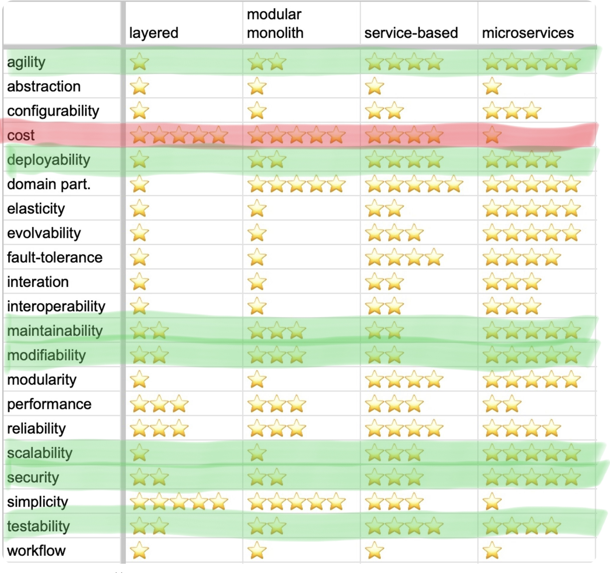
Ну и, учитывая данную таблицу, низкого TTM мы в любом случае не получим:
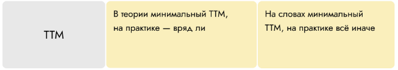

### Итоговая структура микросервисов
Коммуникации выберу асинхронные между сервисами и синхронные внутри, потому что после курса AA узнал, что это весело (На самом деле всё еще не представляю синхронные коммуникации в микросервисах)

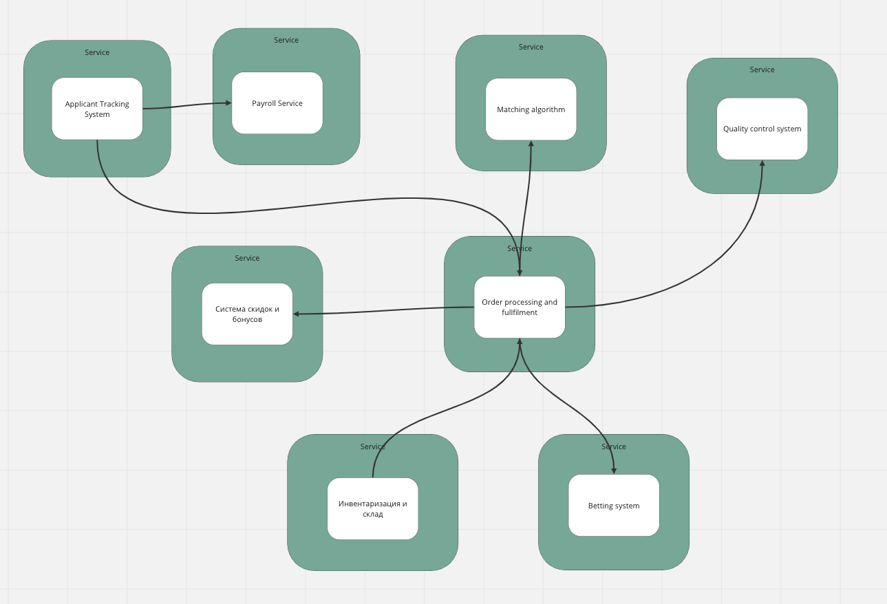

[Miro link with everything](https://miro.com/app/board/uXjVMJwgTXY=/?share_link_id=980702483848)
