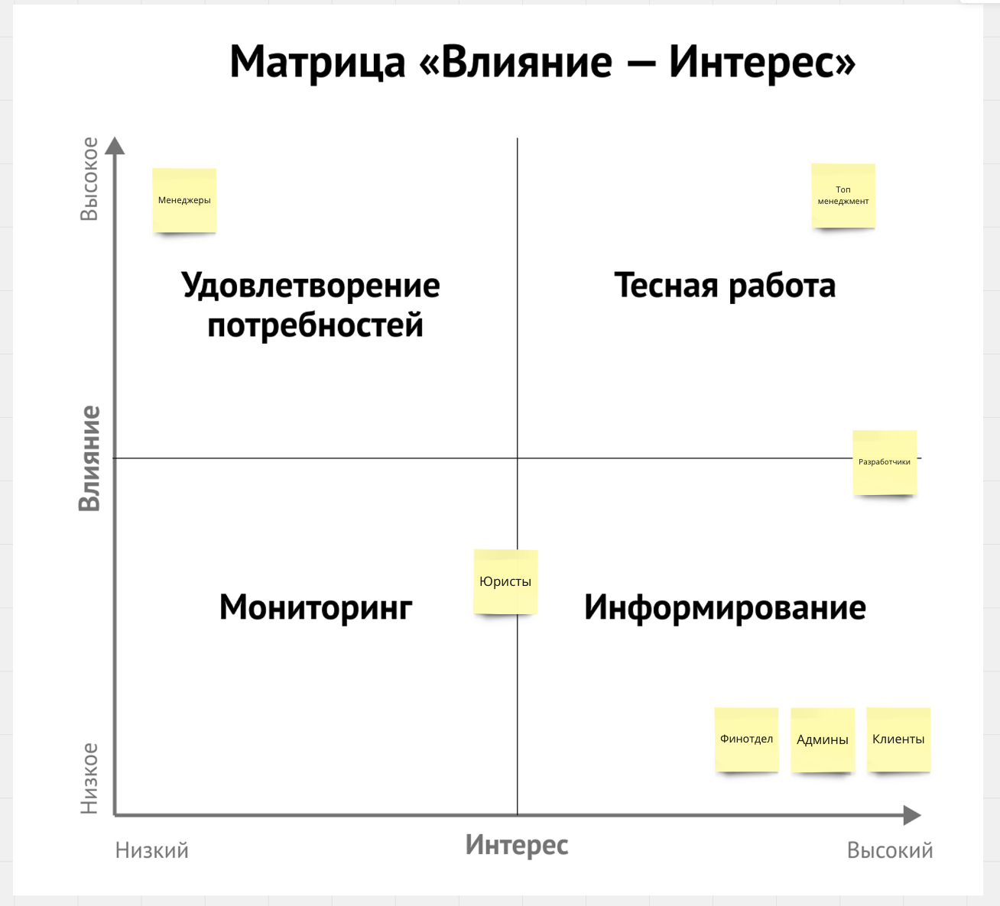
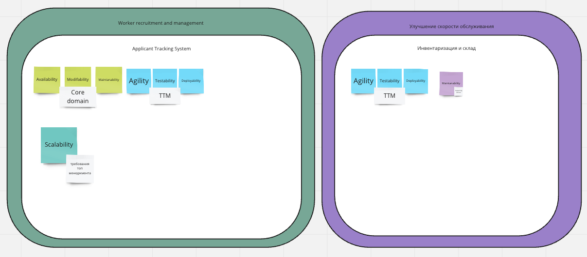
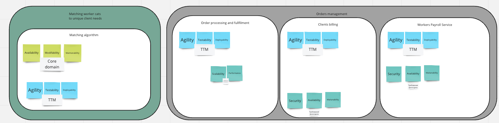
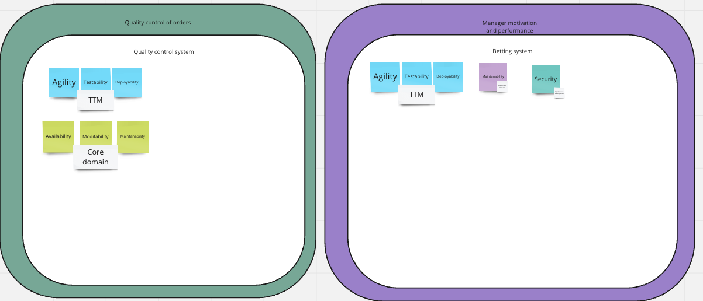

## Предисловие
Заранее извинюсь за качество проделанной работы.
Выяснилось что времени на понимание новой информации (в частности про контексты и поддомены) и добавление её в уже существующую картинку требуется гораздо больше, чем для предыдущих ДЗ. Из-за этого время на выполнение самого ДЗ почти не осталось.
Мой внутренний перфекционист не хотел публиковать данную домашку.

## Матрица стейкхолдеров

Я распределил их таким образом, но нужно смотреть какие ещё позиции есть в этой компании. Скорее всего можно добавить:
- Аналитиков — они будут менять гипотезы, следить за качеством заказов
- Саппорт — юзеры не умеют пользоваться системой, какой бы хорошей она не была. Тем более у них лапки. Поэтому нужен кастомер саппорт.
- Suppliers — работники склада

Да и в целом, тут клиент может решить добавить еще 50 новых ролей, просто потому что. Так что нужно отталкиваться от этого:)

## Характеристики

## Выбор архитектуры
~~Пикачу~~ микросервисы — я выбираю вас

## Сервисы отдельно
- Инвентаризация и склад будет отдельно, потому что мы можем отдать её на аутсорс, плюс использовать различные решения
- Worker recruitment and management — потому что нужна большая Scalability, плюс частота изменений и проверки гепотез не должна сломать остальное приложение
- Матчинг — потому что они ещё в требованиях себе bounded context определили. И никто из остальной команды разработчиков не хочет с ними общаться
- Менеджмент заказов: по-прежнему три сервиса. Сам менеджмент заказов и две оплаты для клиентов и воркеров. У них похожие требования и, наверное будет иметь смысл делать это в одном сервисе чтобы не усложнять коммуникации с оплатой, ведь финотдел просил не ломать эту часть.
- Контроль качества — отдельно из-за скорости проверки гепотиз. (modifability)
- Система ставок — никто не хочет палиться что у нас подпольное казино.

## Базы данных
| Сервис                            | Тип базы | Причины                                                                                                                                    |
| --------------------------------- | -------- | ------------------------------------------------------------------------------------------------------------------------------------------ |
| Инвентаризация и склад            | RDBMS    | Достаточно просто и закрывает все необходимые потребности                                                                                  |
| Worker recruitment and management | RDBMS    | С хорошей scalability и ease of data modeling есть только она и Document (NewSQL я никогда не использовал, может быть правильноее взять её |
| Матчинг                           | RDBMS    | Нужно сопоставлять много данных, связанных между собой. Заказы, инфо о воркерах и клиентах                                                 |
| Менеджмент заказов и оплата       | RDBMS    | Нужно сопоставлять много данных, связанных между собой. Заказы, инфо о воркерах и клиентах.                                                |
| Контроль качества                 | Document | Из-за data modeling                                                                                                                        |
| Система ставок                    | RDBMS    |  RDBMS самая универсальная, все умеют с ней работать и никто не накосячит                                                                                                                                           |
Для контекста, не уверен насколько корректно советовать разработчикам использовать технологии, с которыми у меня не было опыта, руководствуясь только таблицей сравнения, поэтому выбирал между RDBMS, Key-Value и Document

## Вид коммуникаций
Выбираю асинхронные коммуникации, потому что после курса АА считаю что это надежно и удобно (сложно, но систему не будут писать джуны). Архитектура у нас бесплатная, значит можно завезти кафку за $9999 в секунду ну и хотя бы в вымышленном проекте можно об этом помечтать.

## Фитнесс-функции
### Общие
- test coverage > x%
- Проверять переодичность релизов
- Schema-registry и следить за тем какие топики в системе создаются
- анализ метрик coupling и cohesion. Хороший вопрос как это проверять, я думаю это покажет время

### Найм работников
- Частые релизы (раз в неделю)
- Аптайм и респонс тайм (не должно ничего падать под нагрузками)

### Матчинг
- Аптайм и респонс тайм (не должно ничего падать под нагрузками) а заказов у нас будет 10 в секунду

## ADR

**Title.** Изоляция сервиса для найма сотрудников (ADR-001)

**Status.** Accepted

**Context.** Система включает в себя несколько сервисов, связанных между собой и работающих в одной среде. Одним из сервисов является сервис для найма сотрудников. Данный сервис является критически важным для работы проекта.

**Decision.** Принято решение о создании отдельного сервиса для найма сотрудников.
 Изоляция сервиса поможет защитить его от внешних атак и сбоев в других компонентах системы. Микросервисная архитектура позволит гибко масштабировать сервис и улучшить его производительность. Однако использование отдельного сервера или контейнера может потребовать дополнительных затрат на обслуживание и поддержку. Так как у нас бесплатная инфраструктура — нам это не важно. Так же нагрузки могут сильно возрастать и это решение поможет масштабировать сервис соответственно, отдельно от остальной системы.
 
**Consequences**.
Из минусов: Большое количество микросервисов может усложнить управление системой и требовать дополнительных усилий при разработке и тестировании.
