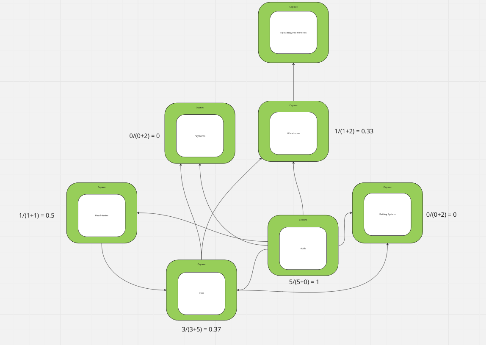
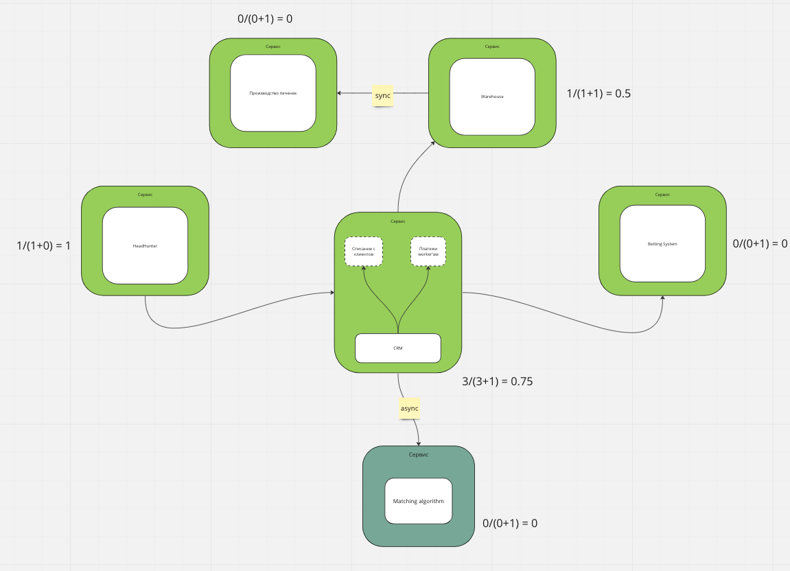

## Изначальная система

### Считаем Instability

### Фиксим и добавляем
Предположим, что у нас есть ресурсы, но нет опыта у разработчиков.
Начнём с новой функциональности, добавим производство печенек.
Из плюсов, нам не нужно самим реализовывать данную штуку, поэтому просто отправляем из склада синхронный запрос с информацией о клиенте на фабрику печенек.

Сервис для AuthN мы тоже уберём, потому что в ТЗ такого не было и вообще непонятно зачем мы его сделали, ведь можно авторизовать котов по отпечатку носиков автоматически.

Далее будем выносить из CRM наш супер Matching Algorithm в отдельный сервис.
Повезло, что у нас была отдельная команда.

Так как нам оказалось нужно поменять тип базы данных на графовую, плюс нам очень важны предыдущие данные, используем Change Data Capture.
Пишем данные в брокер и реализуем (частично копируем, конечно же) логику матчинга.

Далее решаем проблему с платежами. Нужно объеденить сервис платежей и CRM, плюс ко всему разделить логику зарплат воркерам и логику списаний у клиентов.
Используем старый сервис платежей, пока пишем логику для нового. Пусть начнём с сервиса выплаты воркерам. Когда он будет готов — подключаем его и роутим все запросы, связанные с зарплатами воркеров в новый сервис. Из плюсов — он у нас использует одну базу с CRM — так что коммуникации простые. 

Далее точно так же выносим логику для списания с клиентов и просто отключаем старый сервис Payments

Далее выносим систему контроля качества в отдельный сервис. Так как держать два монолита поднятыми дорого, но у нас всё бесплатно — воспользуемся Tactical Forking

Получается система аналогичная той, которая вышла у меня в конце третьей домашки